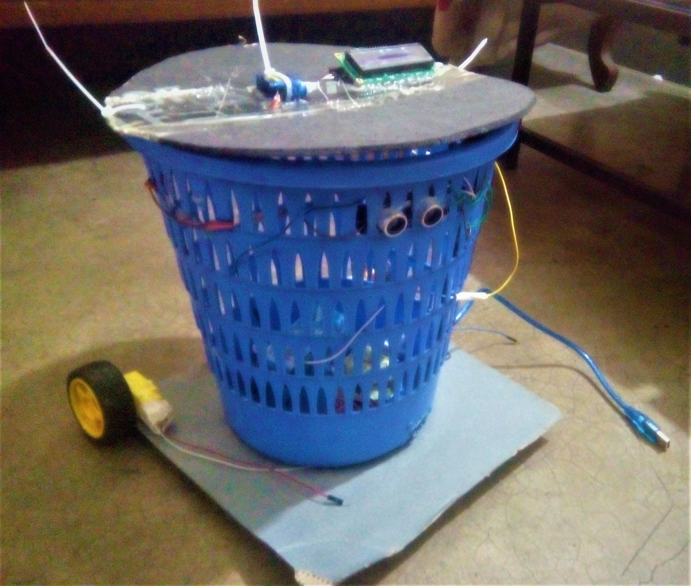

# Facilitated Smart Dustbin

<div align="center">
  
</div>

## Overview

Environmental pollution mainly caused for littering is as old as the civilization itself. It has become a major concern in the
last few decades. It is the by product of the development of civilization and in fact a price for the progress. It is more
prone in case of Bangladesh. People throw trash everywhere and this tendency is very harmful. So we have decided to make a 
smart dustbin which people can easily use to throw trash and that will help to reduce the harm. Basically it will be an easily
accessible dustbin. For more details please visit [here](https://github.com/Solayman-Emon/CSE-3216-Microcontroller-Based-System-Design-Lab/blob/master/Facilitated_Smart_Dustbin/Proposals/Final_Project_Proposal.pdf). 
 

## Visual Representation

<div align="center">
  
</div>

## Citation

If you are using any components of this project please refer this:

```
@csproject{CSE 3216: Microcontroller Based System Design Lab, 
   title={Facilitated Smart Dustbin},
   projectLink={https://github.com/Solayman-Emon/CSE-3216-Microcontroller-Based-System-Design-Lab},
   author={Solayman, Lamia, Nahid, and Toasin} 
}
```

## Contact 

Please contact the first author of the project - Solayman Hossain Emon (solayman.emon07@gmail.com) or raise an issue for any further queries.
